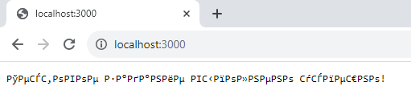
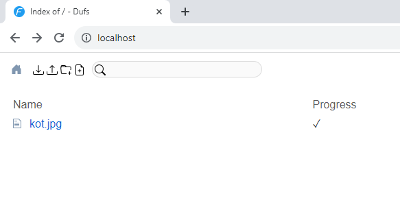

# Slotegrator Test Assignment

## Task 1: Git

Done.

## Task 2: Dockerfile

Критические ошибки в Dockerfile:

1. Опечатка на 2-й строчке `RUN apt-get upddate`
2. `CMD` на 6-й строчке используется в shell-режиме, при этом команда и аргумент к ней указаны в общих кавычках. Из-за этого `CMD` передаёт их как единую строку (вместо двух строк), а `sh` парсит это как массив с одним элементом `$0`, что эквивалентно команде `sh -c ' "node index.js" '` (обратите внимание на одинарные и двойные кавычки), и не может найти исполняемый файл с названием `node\ index.js` (обратный слэш `\` используется для экранирования пробела в пути к файлу) в своей переменной `$PATH`, о чём и сообщает в логах:

```shell
flo@knightly-flo:~/slotegrator_test$ docker logs slotegrator 
/bin/sh: 1: node index.js: not found
```

Исправив опечатку и убрав кавычки в `CMD`, приложение в контейнере заработало:

```shell
flo@knightly-flo:~$ curl localhost:3000
Тестовое задание выполнено успешно!
```

Но открыв браузер, обнаружилась проблема с кодировками (на моей машине с Windows 11, на Linux/Mac данный баг может отсутсвовать):



Данная ошибка вызвана отсутствием явного указания кодировки HTML-страницы, и решается добавлением в HTTP заголовок ответа сервера в кодировку UTF-8 в `index.js`:

```javascript
res.writeHead(200, { 'Content-Type': 'text/plain; charset=utf-8' });
```

После чего можно наблюдать в браузере работающее приложение:


## Task 3: Kubernetes

Данную задачу выполнял в дистрибутиве Kubernetes для локальной разработки и тестирования [kind](https://kind.sigs.k8s.io/). Конфигурация кластера kind находится в файле [kind-cluster-config.yaml](./task_kubernetes/kind/kind-cluster-config.yaml). В ней указан проброс портов 80 и 443 для использования с Ingress, а также специальная метка `ingress-ready: true` для узла, на которую может установиться Ingress (эти особенности нужны для запуска Ingress в локальном кластере kind).

Запуск кластера kind:

```shell
kind create cluster --config ./task_kubernetes/kind/kind-cluster-config.yaml
```

kind при создании включает в себя `StorageClass` для динамического обеспечения `PersistentVolume`, используя provisioner [rancher.io/local-path](https://github.com/rancher/local-path-provisioner):

```shell
flo@knightly-flo:~/slotegrator_test$ kubectl get storageclasses.storage.k8s.io 
NAME                 PROVISIONER             RECLAIMPOLICY   VOLUMEBINDINGMODE      ALLOWVOLUMEEXPANSION   AGE
standard (default)   rancher.io/local-path   Delete          WaitForFirstConsumer   false                  145m
```

Данный `StorageClass` будет использоваться для динамического provisioning-а `PersistentVolume` для пода на основе созданного `PersistentVolumeClaim`, используя локальное хранилище (тип `hostPath`).

Установка Nginx Ingress в кластер kind (отличается от классической установки Nginx Ingress использованием специфических манифестов для kind):

```shell
kubectl apply -f https://raw.githubusercontent.com/kubernetes/ingress-nginx/main/deploy/static/provider/kind/deploy.yaml
```

В качестве тестового веб-приложения я взял файловый сервер [dufs](https://github.com/sigoden/dufs) - на мой взгляд, лучший вариант для проверки персистентного хранилища.

Все манифесты (Deployment, PersistentVolumeClaim, Service, Ingress) находятся в директории [manifests](task_kubernetes/manifests/) как по отдельности, так и в виде объединённого файла [all-in-one.yaml](task_kubernetes/manifests/all-in-one.yaml).

Деплой приложения:

```shell
kubectl apply -f ./task_kubernetes/manifests/all-in-one.yaml
```

Проверка динамического provisioning-а с помощью `StorageClass`:

```shell
flo@knightly-flo:~$ kubectl get pvc
NAME                   STATUS   VOLUME                                     CAPACITY   ACCESS MODES   STORAGECLASS   AGE
slotegrator-test-pvc   Bound    pvc-f3d61207-6c05-43ef-b06e-a90ca590859d   1Gi        RWO            standard       46m

flo@knightly-flo:~$ kubectl get pv
NAME                                       CAPACITY   ACCESS MODES   RECLAIM POLICY   STATUS   CLAIM                          STORAGECLASS   REASON   AGE
pvc-f3d61207-6c05-43ef-b06e-a90ca590859d   1Gi        RWO            Delete           Bound    default/slotegrator-test-pvc   standard                46m
```

Проверка доступа в кластер снаружи через Ingress:

```html
flo@knightly-flo:~/slotegrator_test$ curl localhost
<!DOCTYPE html>
<html>

<head>
  <meta charset="utf-8" />
  <meta name="viewport" content="width=device-width" />
  <link rel="icon" type="image/x-icon" href="/__dufs_v0.36.0_favicon.ico">
  <link rel="stylesheet" href="/__dufs_v0.36.0_index.css">
...
```

И в браузере открывается интерфейс файлового сервера:


Загрузим тестовую картинку `kot.jpg`:



По нажатию на имя файла, а также по роуту `localhost/kot.jpg` она будет доступна к просмотру:


Проверим, сохранится ли изображение после удаления и пересоздания нового контейнера. Для этого получим имя пода, удалим его, и убедимся, что был создан новый под:

```shell
flo@knightly-flo:~/slotegrator_test$ kubectl get pods -l app=slotegrator-test
NAME                                READY   STATUS    RESTARTS   AGE
slotegrator-test-578876f485-l9tvn   1/1     Running   0          42m

flo@knightly-flo:~/slotegrator_test$ kubectl delete pods slotegrator-test-578876f485-l9tvn
pod "slotegrator-test-578876f485-l9tvn" deleted

flo@knightly-flo:~/slotegrator_test$ kubectl get pods -l app=slotegrator-test
NAME                                READY   STATUS    RESTARTS   AGE
slotegrator-test-578876f485-k4xvs   1/1     Running   0          3m42s
```

В браузере видно, что картинка никуда не пропала:


Следовательно, механизм персистетного хранения реализован, и задание успешно выполнено.

### Дополнительная задача: настройка автомасштабирования с помощью `HorizontalPodAutoscaler` на основе загрузки ЦП и/или памяти

Для настройки автомасштабирования требуется установить в кластер __Metrics Server__ и применить патч для кластера kind:

```shell
kubectl apply -f https://github.com/kubernetes-sigs/metrics-server/releases/latest/download/components.yaml

kubectl patch -n kube-system deployment metrics-server --type=json \
  -p '[{"op":"add","path":"/spec/template/spec/containers/0/args/-","value":"--kubelet-insecure-tls"}]'
```

Проверка установки Metrics Server (нужно выждать некоторое время после установки, прежде чем Metrics Server будет работать):

```shell
flo@knightly-flo:~/slotegrator_test$ kubectl top pod 
NAME                                CPU(cores)   MEMORY(bytes)   
slotegrator-test-67b75f69f9-h2mbz   1m           1Mi
```

Применим манифест [hpa.yaml](./task_kubernetes/manifests/extra_task/hpa.yaml):

```shell
flo@knightly-flo:~/slotegrator_test$ kubectl apply -f ./task_kubernetes/manifests/extra_task/hpa.yaml 
horizontalpodautoscaler.autoscaling/slotegrator-test-autoscale created
```

Проверим HPA:

```shell
flo@knightly-flo:~/slotegrator_test$ kubectl get horizontalpodautoscalers.autoscaling slotegrator-test-autoscale 
NAME                         REFERENCE                     TARGETS          MINPODS   MAXPODS   REPLICAS   AGE
slotegrator-test-autoscale   Deployment/slotegrator-test   2%/50%, 0%/50%   1         10        1          61s
```

Теперь создадим нагрузку на ЦПУ и проверим, будут ли создаваться новые реплики. В одном окне терминала создадим нагрузку, а в другом будем следить за количеством реплик:

```shell
flo@knightly-flo:~$ while true; do curl -s localhost -o /dev/null; done
```

```shell
flo@knightly-flo:~/slotegrator_test$ kubectl get horizontalpodautoscalers.autoscaling slotegrator-test-autoscale --watch
NAME                         REFERENCE                     TARGETS          MINPODS   MAXPODS   REPLICAS   AGE
slotegrator-test-autoscale   Deployment/slotegrator-test   2%/50%, 0%/50%   1         10        1          4m40s
slotegrator-test-autoscale   Deployment/slotegrator-test   2%/50%, 0%/50%   1         10        1          5m
slotegrator-test-autoscale   Deployment/slotegrator-test   18%/50%, 0%/50%   1         10        1          5m15s
slotegrator-test-autoscale   Deployment/slotegrator-test   130%/50%, 0%/50%   1         10        1          5m30s
slotegrator-test-autoscale   Deployment/slotegrator-test   130%/50%, 0%/50%   1         10        3          5m45s
slotegrator-test-autoscale   Deployment/slotegrator-test   76%/50%, 0%/50%    1         10        3          6m
slotegrator-test-autoscale   Deployment/slotegrator-test   44%/50%, 1%/50%    1         10        3          6m15s
```

Автоскейлер успешно справился с нагрузкой на ЦПУ, доведя число реплик до 3-х.

Для проверки памяти установим в кластер kind инструмент для нагрузочного тестирования/chaos engineering __Chaos Mesh__:

```shell
curl -sSL https://mirrors.chaos-mesh.org/v2.6.2/install.sh | bash -s -- --local kind
```

Применим манифест нагрузочного тестирования памяти [chaos-mesh-memtest.yaml](./task_kubernetes/manifests/extra_task/chaos-mesh-memtest.yaml), после чего вновь следим за действиями автоскейлера:

```shell
flo@knightly-flo:~/slotegrator_test$ kubectl apply -f ./task_kubernetes/manifests/extra_task/chaos-mesh-memtest.yaml && kubectl get horizontalpodautoscalers.autoscaling slotegrator-test-autoscale --watch
stresschaos.chaos-mesh.org/slotegrator-test-memorytest created
NAME                         REFERENCE                     TARGETS          MINPODS   MAXPODS   REPLICAS   AGE
slotegrator-test-autoscale   Deployment/slotegrator-test   2%/50%, 1%/50%   1         10        1          21m
slotegrator-test-autoscale   Deployment/slotegrator-test   8%/50%, 69%/50%   1         10        1          21m
slotegrator-test-autoscale   Deployment/slotegrator-test   8%/50%, 69%/50%   1         10        2          21m
```

Также как и с ЦПУ, автоскейлер повысил количество реплик после превышения установленного процента утилизации памяти.

## Feedback

<details>
    <summary>Мои мысли касательно тестового задания:</summary>

По заданию №2: задание мне показалось настолько простым, что даже подозрительно - действительно ли для решения задачи достаточно исправить одну опечатку и убрать кавычки... Ещё есть ощущение, что  проблемы с кодировками изначально не должно было быть - т.к. в тексте задания написано, "Новый Dockerfile на основе данного с починкой всех проблем", что как бы подразумевает, что проблемы находятся только в докерфайле, а не в коде. Но в целом, даже если учитывать баг с кодировкой, задача всё равно настолько подозрительно простая, что бо́льшую часть времени думаешь не над решением, а над поиском потенциальных "подводных камней".

По заданию №3: полная противоположность задания №2, но не в плане сложности, а в плане некоторого отсутствия ясности и неопределённости в описании задачи. Возможно, это лично моя проблема - тут спорить не буду, всё субъективно.

Почему мне так показалось:

1. Описание задачи:
    > "хранить данные с использованием механизма персистентного хранения, предоставляемого Kubernetes Storage Classes"

    Насколько я знаю, и насколько я понимаю документацию Kubernetes, концепт `StorageClasses` позволяет описать различные "классы" (т.е. "уровни" или "виды") различных типов хранилищ (например, разделить хранилища на "быстрые" и "медленные"), а также предоставляет возможность делать динамический provisioning `PersistentVolume` на основе имеющегося `PersistentVolumeClaim`, с помощью встроенного (поставляемого с Kubernetes) или внешнего `provisioner`-а. Но непосредственно механизм персистеного хранения предоставляется в Kubernetes через `PersistentVolume`. Как я понимаю, в данном случае имеется в виду *"хранить данные с использованием механизма персистентного хранения в Kubernetes (`PersistentVolume`), динамическим образом обеспеченное с помощью `StorageClasses`"*.

2. Сам текст задачи:

    >Напишите манифесты Kubernetes (Deployment, Service, Ingress и, при необходимости, PersistentVolumeClaim)

    Почему "при необходимости"? Означает ли это, что задачу можно корректным образом выполнить, не создавая PVC? Но как тогда реализовать персистентное хранение? Возможно, я чего-то не понял, но мне показалось это странным. Тем более, что далее написано, что PVC создавать нужно (что логично):

    >Создайте PersistentVolumeClaim (PVC) и используйте Storage Class для обеспечения персистентного хранения данных приложения.

    Тут та же проблема в описании, что и в п.1, как я понимаю, имелось в виду *"... используйте `StorageClass` для динамического обеспечения персистентного хранения данных приложения"*

Опять же, не факт, что в этих пунктах есть какая-то проблема - возможно, я просто что-то не до конца понял, или же наоборот, излишне "докопался" до описания задачи, поэтому я не утверждаю свою правоту. Скорее, я просто решил поделиться своими мыслями по поводу технического задания.
</details>

Большое спасибо за прочтение и уделённое мне время! С радостью буду ждать вашего ответа по итогам проверки технического задания.
